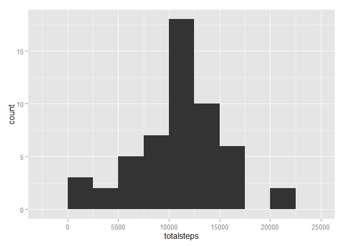
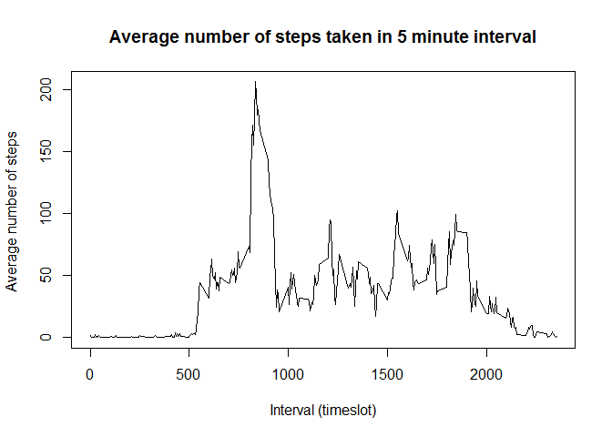
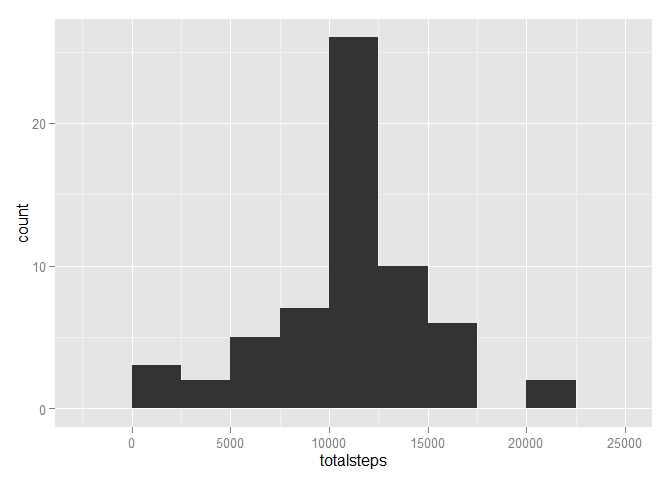
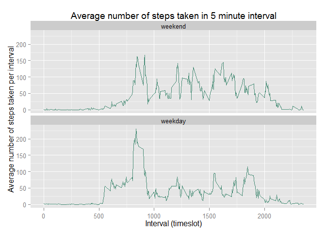

# Reproducible Research: Peer Assessment 1
Borghetti  
Thursday, February 12, 2015  

## Initializing the library

```r
library(dplyr)
```

```
## 
## Attaching package: 'dplyr'
## 
## The following object is masked from 'package:stats':
## 
##     filter
## 
## The following objects are masked from 'package:base':
## 
##     intersect, setdiff, setequal, union
```

```r
library(ggplot2)
library(lubridate)
```


## Loading and preprocessing the data

1.  Load the data 

We start by unzipping the activity data 


```r
unzip("./activity.zip")
```
Now load the CSV file


```r
ad <- read.csv("activity.csv",stringsAsFactors = FALSE)
```

2. Process/transform the data

Add a column which converts the date column into an R-friendly format.  
Note that the `date` column and the `interval` column are used to create a new column called rdate

```r
ad <- mutate(ad,rdate=lubridate::ymd(date))
```

Now we group the data by `rdate` to make it easier to do analysis 


```r
adg<- group_by(ad,rdate)
```


## What is mean total number of steps taken per day?

1.  Calculate the total number of steps taken per day

```r
stepsperday<-summarise(adg,totalsteps=sum(steps))
stepsperday
```

```
## Source: local data frame [61 x 2]
## 
##         rdate totalsteps
## 1  2012-10-01         NA
## 2  2012-10-02        126
## 3  2012-10-03      11352
## 4  2012-10-04      12116
## 5  2012-10-05      13294
## 6  2012-10-06      15420
## 7  2012-10-07      11015
## 8  2012-10-08         NA
## 9  2012-10-09      12811
## 10 2012-10-10       9900
## ..        ...        ...
```

2.  Make a histogram of the total number of steps taken each day


```r
qplot(totalsteps,data=stepsperday, geom="histogram", binwidth=2500)
```

 

3.  Calculate and report the mean and median of the total number of steps taken per day

Note that there are `NA` values in this data at this point, so computing a `mean` or `median` would be pointless.  I therefore decided to compute the means and medians using `na.rm = TRUE`.  What this implies is that the denominator of the mean calculation will be smaller than if these values were filled in (as we will do in the next part of the assignment)


```r
mean(stepsperday$totalsteps,na.rm = TRUE)
```

```
## [1] 10766.19
```

```r
median(stepsperday$totalsteps,na.rm = TRUE)
```

```
## [1] 10765
```


## What is the average daily activity pattern?

1.  Make a time series plot (i.e. type = "l") of the 5-minute interval (x-axis) and the average number of steps taken, averaged across all days (y-axis)

First we need to find the average steps per time slot (ignoring days).  Again we use `na.rm = TRUE`:


```r
adp<-group_by(ad,interval)
perslot<-summarise(adp,meansteps=mean(steps, na.rm=TRUE))
perslot
```

```
## Source: local data frame [288 x 2]
## 
##    interval meansteps
## 1         0 1.7169811
## 2         5 0.3396226
## 3        10 0.1320755
## 4        15 0.1509434
## 5        20 0.0754717
## 6        25 2.0943396
## 7        30 0.5283019
## 8        35 0.8679245
## 9        40 0.0000000
## 10       45 1.4716981
## ..      ...       ...
```

Next we make the X-Y plot:

```r
plot(perslot$interval,perslot$meansteps,type="l", 
     ylab = "Average number of steps ",
     xlab = "Interval (timeslot)",
     main = "Average number of steps taken in 5 minute interval"
     )
```

 


2.  Which 5-minute interval, on average across all the days in the dataset, contains the maximum number of steps?


```r
perslot$interval[which.max(perslot$meansteps)]
```

```
## [1] 835
```


## Imputing missing values

1. Calculate and report the total number of missing values in the dataset (i.e. the total number of rows with NAs)

Note that we are only counting the number of NAs occuring in the `steps` variable.


```r
sum(is.na(ad$steps))
```

```
## [1] 2304
```


2. Devise a strategy for filling in all of the missing values in the dataset. The strategy does not need to be sophisticated. For example, you could use the mean/median for that day, or the mean for that 5-minute interval, etc.

Strategy:  We've previously computed the mean across all days for each timeslot.  We will use this value as a imputed value for all `steps` observations which currently have NAs

3. Create a new dataset that is equal to the original dataset but with the missing data filled in.

Now we need to fill in the missing values using the average timestep values.

We will use a trick - first add an extra variable column containing the mean of all timesteps, then populate the missing step values with this mean.  Finally, we will re-sort the data to get it back to the original ordering (by date then interval)


```r
adfixed<- merge(ad,perslot, 
                suffixes = c("",".mean"),
                by="interval",
                sort=FALSE,
                all.x=TRUE, all.y=FALSE)

adfixed[is.na(adfixed$steps),"steps"]<-adfixed[is.na(adfixed$steps),"meansteps"]

adfixed<-arrange(adfixed,date,interval)
```


4. Make a histogram of the total number of steps taken each day and Calculate and report the mean and median total number of steps taken per day. 

we have to group our data again, then histogram it


```r
adfixedg<- group_by(adfixed,rdate)
fixedstepsperday<-summarise(adfixedg,totalsteps=sum(steps))
fixedstepsperday
```

```
## Source: local data frame [61 x 2]
## 
##         rdate totalsteps
## 1  2012-10-01   10766.19
## 2  2012-10-02     126.00
## 3  2012-10-03   11352.00
## 4  2012-10-04   12116.00
## 5  2012-10-05   13294.00
## 6  2012-10-06   15420.00
## 7  2012-10-07   11015.00
## 8  2012-10-08   10766.19
## 9  2012-10-09   12811.00
## 10 2012-10-10    9900.00
## ..        ...        ...
```

```r
qplot(totalsteps,data=fixedstepsperday, geom="histogram", binwidth=2500)
```

 

Now we report mean and median. Note that there are no `NA` values in this data at this point.


```r
mean(fixedstepsperday$totalsteps)
```

```
## [1] 10766.19
```

```r
median(fixedstepsperday$totalsteps)
```

```
## [1] 10766.19
```

*Do these values differ from the estimates from the first part of the assignment?* 

The mean did not change - it remained 
1.0766\times 10^{4}.
The median did change.  Before the `NA` values were replaced, the median was 
1.0765\times 10^{4},
and after they were replaced it became 
1.0766\times 10^{4}


*What is the impact of imputing missing data on the estimates of the total daily number of steps?*

The mean number of steps per timeslot doesnt change because we replaced every missing step value with the mean number of steps in that timeslot (taken over all days).  Mathematically, this means we are not altering the mean of any timeslot.   

The median does shift however.  The median is the value which holds the middle-ranked position in a total ordering of the values.  When we replaced the NA values with timeslot means, the rank ordering was shifted and a new value took the middle-ranked position.

## Are there differences in activity patterns between weekdays and weekends?

1.  Create a new factor variable in the dataset with two levels – “weekday” and “weekend” indicating whether a given date is a weekday or weekend day.

We will use the `chron` package since it offers a convenient way to check for whether a date is a weekend: `is.weekend(mydate)`.


```r
library(chron)
```

```
## 
## Attaching package: 'chron'
## 
## The following objects are masked from 'package:lubridate':
## 
##     days, hours, minutes, seconds, years
```

```r
adfixed<-mutate(adfixed,weekend=as.factor(is.weekend(rdate)))
adfixed$weekend<-factor(adfixed$weekend,
                        levels = c(TRUE, FALSE),
                        labels = c("weekend","weekday"))
```


2.  Make a panel plot containing a time series plot (i.e. type = "l") of the 5-minute interval (x-axis) and the average number of steps taken, averaged across all weekday days or weekend days (y-axis). See the README file in the GitHub repository to see an example of what this plot should look like using simulated data.


```r
adfixedi<-group_by(adfixed,interval,weekend)
fixedperslot<-summarise(adfixedi,meansteps=mean(steps))


ggplot(fixedperslot, aes(interval,meansteps))+
  geom_line(color="aquamarine4")+
  facet_wrap(~weekend, nrow=2) +
  ylab("Average number of steps taken per interval") +
  xlab("Interval (timeslot)")+
  ggtitle("Average number of steps taken in 5 minute interval")
```

 


